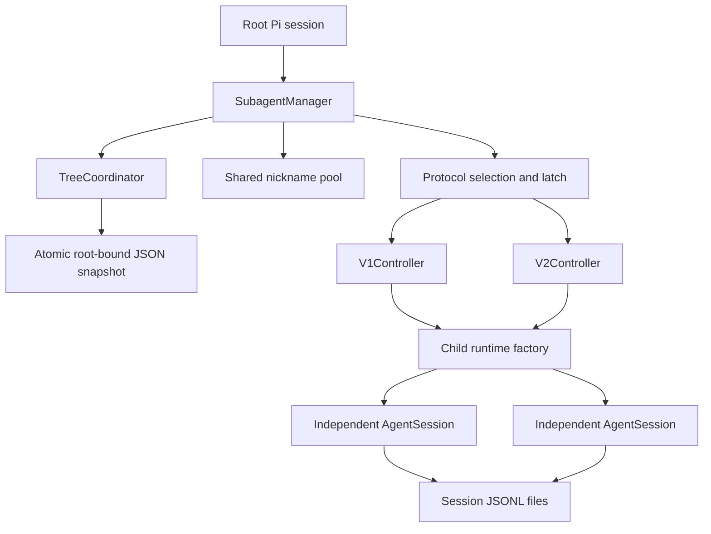
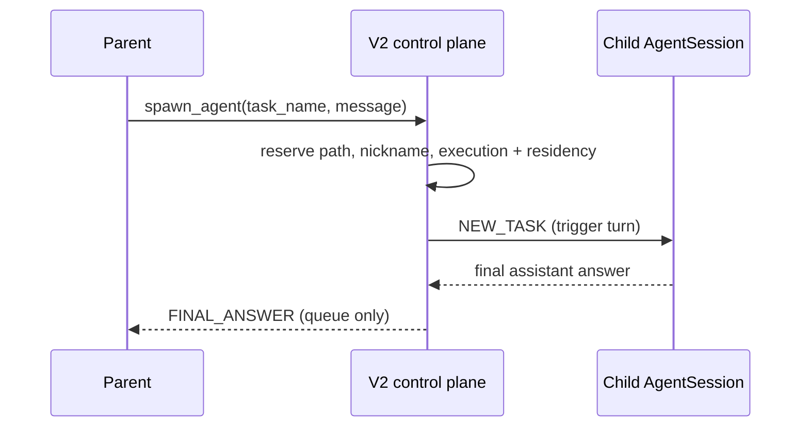

# Subagent protocols and architecture

This document is the normative Pi model-facing and runtime contract for the subagents extension. The extension hosts independent Pi `AgentSession` children behind one root-scoped control plane. It supports two mutually exclusive model-facing protocols while sharing only Pi session hosting, selection, persistence, configuration, and nicknames.

The [Codex model-facing contract](codex-model-facing-contract.md) is a descriptive pinned upstream reference, not a Pi implementation specification. The broader [Codex implementation reference](codex-reference.md) explains upstream architecture. The [parity ledger](codex-parity.md) records every known match and difference, including intentional and unsupported differences.

## Compatibility objective

This extension is the collaboration half of a compatibility effort shared with [`codex-provider`](../../codex-provider). The working premise is that Codex models are trained and tuned for the native Codex CLI harness, so reducing model-facing distribution shift should improve their behavior in Pi.

The default is therefore to match every portable collaboration surface in the pinned Codex implementation: tool families, names, schemas, descriptions, ordering, results, prompt guidance, addressing, messages, history boundaries, errors, persistence, and lifecycle semantics. Pi may differ only when the backend reserves the native contract, Pi cannot execute it truthfully, matching would reduce safety or correctness, or the Pi host lacks the required representation. Those differences must be explicit in the parity ledger and covered at the smallest practical test layer. They should be reconsidered when either host gains new capabilities.

Pi remains authoritative for unrelated application behavior such as its base prompt, project instructions, permissions, extension lifecycle, and session representation. The upstream references provide compatibility evidence; this document defines the truthful Pi projection.

## Protocol selection

The extension resolves and latches the protocol when the first root turn starts:

1. An exact non-`auto` `provider/model` config override wins.
2. An exact `auto` bypasses the wildcard; otherwise a non-`auto` `*` override wins.
3. A resume or root fork inherits the stored protocol.
4. Otherwise `model.multiAgentVersion` selects `v1`, `v2`, or `off` (`disabled`), with V1 as the undeclared fallback.

`auto` means “use model metadata or the V1 default.” An exact `auto` intentionally bypasses `*`. The Codex provider projects its catalog's `multi_agent_version` field onto dynamic Pi model objects as `multiAgentVersion`. The packages have no import dependency; when both are loaded, a synchronous session contract carries the selected collaboration profile to the provider and active or inherited Ultra state between the provider and V2 controller. Read-only requests omit Ultra, while the provider's Ultra owner sends an explicit boolean when active state changes.

Later incompatible model selections keep the latched tools and show a warning. Resume restores the latch. A root fork inherits only the protocol into a new root session ID and empty control graph. An explicit current config override beats inherited state and starts a new control generation. V2 descendants stay in the same tree protocol but receive collaboration tools only when the child's resolved model itself declares V2.

On Codex Responses requests, the provider groups both Pi protocols under the extension-owned `pi_subagents` namespace. It deliberately does not claim Codex's reserved `collaboration` or `multi_agent_v1` identities: the backend requires their configured schemas, including encrypted argument semantics that Pi cannot execute end to end.

## Architecture



```text
subagents/
├── manager.ts          # lifecycle, latch, root delivery, /agents
├── coordinator.ts      # serialized authoritative tree transactions
├── config.ts           # strict global config and role resolution
├── contract.ts         # session-scoped provider collaboration profile
├── runtime.ts          # independent Pi AgentSession host
├── transcript.ts       # forward-only transcript persistence verifier
├── permanent-error.ts # terminal child persistence failure
├── history.ts          # sanitized none/all/last-N forks
├── nicknames.ts        # tree-wide unique presentation names
├── selection.ts        # model/config protocol resolution
├── snapshot.ts         # bounded atomic control-store persistence
├── v1/                 # UUID/open-edge protocol and rich input
└── v2/                 # path/mailbox protocol
```

Each child has a separate context, model loop, extension runner, and session file. Children share the root's cwd, trust decision, model registry, active runtime credentials, context files, and discovered skill catalog. Role settings can narrow or specialize model, thinking level, and instructions; they cannot change cwd or trust. A role may select a bare model within the inherited provider, but a role that sets `provider` must also set `model`; Pi never combines a role provider with an inherited or per-call model ID.

## Model-facing prompt contract

Pi owns the prompt hierarchy. Collaboration guidance is appended through Pi's supported system-prompt hooks rather than fabricated as Codex developer-role world state. Each collaboration prompt is composed from independent layers:

1. Stable facts define identity, addressing, mailbox format, shared-filesystem behavior, and delivery to the parent.
2. A protocol-specific usage hint explains only tools the current agent can call.
3. Delegation mode states whether delegation requires an explicit request or may be proactive.
4. A V2 child capability layer is resolved from the child's actual model before every turn.

Configured `prompts.v1.root` and `prompts.v2.root` replace the corresponding root usage-hint layer. `prompts.v2.child` replaces only the collaboration usage hint of an eligible V2 child; it is never shown to an ineligible child. `prompts.child` is a capability-independent instruction shared by V1 and V2 children. An explicitly empty value suppresses that layer, but not stable identity facts or delegation mode for an agent that can delegate. V1 children never receive collaboration tools. A V2 child receives their tools and delegation mode only when its resolved model declares V2; an ineligible child is told to complete its task directly.

When the load-last Codex provider has Ultra active, it appends a separate proactive mode block after these layers. That branch-scoped policy overrides configured explicit delegation without replacing the subagents-owned usage or capability guidance. Native Max alone does not add the block.

The model-visible mailbox text is stable. Queue-only and steered mail is stored as a Pi custom session message; an idle child's triggering task is stored as the single user message that starts its turn. Both project to the provider as ordinary user-role LLM input. Codex instead has a structured `AgentMessage` representation. Using Pi's normal prompt lifecycle for triggering mail preserves `before_agent_start`, which is required for child model resolution, tool gating, prompt policy, and provider contract publication.

## V1 flow

V1 is the legacy UUID protocol and defaults to six open root children. Child sessions do not receive subagent tools, so nesting depth is one.

```text
spawn_agent(message XOR items)
  validate rich input and optional skill/image references
  stage UUID + nickname outside published state
  materialize or validate an identity-bound child transcript
  atomically publish the Open edge, pending task, and session path
  start child turn
  return agent_id + nickname

child completes or errors
  atomically publish final status + root notification outbox item
  deliver <subagent_notification> to the root at least once
  keep the Open slot and resident session

child is interrupted
  persist reusable non-final status without a notification

close_agent
  atomically mark the target edge Closed and discard queued work
  stop the target
  unload its runtime and release the target slot

resume_agent
  count in-flight spawns against the open-child limit
  validate and eagerly load the target transcript
  atomically reopen the target edge
```

The five V1 tools are `spawn_agent`, `send_input`, `resume_agent`, `wait_agent`, and `close_agent`. `spawn_agent` and `send_input` accept exactly one of plain `message` or rich `items`. Rich items are intentionally limited to text, base64 image data URLs, trusted-project local images, and discovered Pi skills.

The atomic control snapshot owns V1 task ordering. Each agent has at most one active task and a FIFO queue. A task is published as `pending` before the child is invoked and becomes `running` only after the child user message is durable. A crash can therefore redeliver a pending task; this is intentional at-least-once delivery. A running task restores as `interrupted`, because Pi cannot resume an abandoned provider execution. The child transcript is never interpreted as controller state, so an assistant answer that reaches the transcript before the terminal control transaction is not reconstructed after a crash. Destructive `send_input` publishes its replacement without waiting indefinitely for suspended preflight teardown; the old runtime remains fenced from transcript reuse, and replacement delivery begins after that teardown finishes.

A V1 completion notification admitted before the root's current agent run reaches `agent_end` is active input. Pi steers that notification, so it can produce a follow-up response even after visible final text. At or after the cutoff Pi records the notification at the next safe settlement or input boundary without starting a turn. This timing is a Pi host-lifecycle approximation of Codex's distinction between injecting a V1 response item into an active task and recording it in idle history.

## V2 flow

V2 uses canonical paths such as `/root/research/tests`. A child whose resolved model declares V2 can spawn descendants with the same six tools as the root: `spawn_agent`, `send_message`, `followup_task`, `wait_agent`, `interrupt_agent`, and `list_agents`.

An Ultra parent marks a newly spawned child for Ultra inheritance when `reasoning_effort` is omitted and the selected role does not configure reasoning. The child contract returns that signal to its provider, which persists the child's branch state; an explicit reasoning effort or role-configured reasoning prevents inheritance. The V2 controller remains the only owner of the tools, hierarchy, and runtime in both cases.



Mailbox messages use Codex's model-visible `Message Type`, `Task name`, `Sender`, and `Payload` text envelope. Bookkeeping details carry the durable communication ID but are not relied on for model visibility.

- `send_message` queues context without starting an idle turn. A nonresident target is reloaded so the queue can accept the message, but no model turn starts.
- `followup_task` starts an idle turn or steers an active one.
- Triggering task mail remains in the control outbox until the child transcript durably accepts its user turn. The same transaction changes the node from `pending` to `running` and removes the task mail. A crash before that transaction may redeliver the task.
- Queue-only mail admitted during a model response stays in an extension-owned gate until a safe Pi lifecycle boundary. At `turn_end`, one admitted item is steered into an already-required nonterminating tool continuation only when Pi has no pending textual steer or follow-up. Otherwise it remains gated through later turns. Final, errored, aborted, and all-terminating responses do not release it, but a later retry response can release it into a qualifying tool continuation. Anything still gated at `agent_settled` is passively recorded and transcript-verified before runtime retirement, without starting another request or changing retry and compaction context.
- Queue-only mail remains in the control outbox until the child transcript durably records its communication ID. Mail is published before admission, an active `wait_agent` is notified on admission, and delivery is serialized per target. Codex drains every mailbox item present at one native poll; Pi admits and acknowledges same-target items independently, so request grouping can differ while FIFO identity and durability are preserved.
- Terminal node status and its direct-parent `FINAL_ANSWER` outbox item publish in one transaction. If that transaction is absent after a crash, an earlier `running` node restores as `interrupted`; the child transcript is not searched for an answer.
- `interrupt_agent` atomically records `interrupted` and removes all undelivered triggering mail for the target from the control snapshot. It then cancels queued triggering work, aborts the child, and starts unloading its runtime without waiting indefinitely for suspended preflight teardown. The old runtime remains fenced from transcript reuse; later mail stays durable and begins delivery after teardown finishes. This is intentionally deterministic: native Codex clears pending input already drained into the active turn, but mailbox work not yet drained can survive interruption and start a fresh turn. Pi cancels both. A later explicit follow-up starts a new delivery.
- `wait_agent` observes mailbox or user-input activity and never returns payloads.
- Completion sends `FINAL_ANSWER` only to the direct parent; it does not bubble recursively.
- `interrupt_agent` rejects an unknown path, reports `not_found` for a known nonresident path, leaves an interrupted durable identity reusable, and does not emit completion.

Pi has no Codex response-item callback between reasoning, commentary, and final-answer items. Its V2 boundary is therefore the aggregate assistant response plus its tool batch: mail that native Codex could consume after a reasoning or commentary item may instead wait when later final text occurs in the same response. Pi can detect pending textual steer and follow-up queues, but not custom steering from other extensions, so arbitrary third-party request grouping remains host-owned.

Root notifications remain in the outbox until a matching custom-message entry is visible in the durable root branch and its removal is atomically published. Root mail that arrives while idle outside a safe settlement boundary stays durable in the control outbox. At the next normal input, Pi synchronously drains, verifies, and acknowledges it before the new root prompt takes its provider snapshot. If a trusted root extension removes delivery metadata, Pi conservatively retains and may redeliver the item. Child loading and other fallible preconditions complete before new mail is published. Waiting for transcript acceptance does not hold the target's control-operation queue, so `interrupt_agent` can still reach the active runtime. A V2 spawn remains provisional and unaddressable until its transcript, runtime lease, node, and initial task publish together.

By default, the root plus at most three child turns can run concurrently, and at most three child runtimes may be resident. Terminal and explicitly interrupted V2 runtimes are unloaded; their durable identities reload on later communication. This is deliberately simpler than Codex's LRU residency cache while preserving its model-facing lazy-load behavior. Codex-compatible `list_agents` output shows only resident runtimes; `/agents` shows all durable identities.

## Forking and persistence

`fork_turns` follows Codex parsing: surrounding whitespace and ASCII case are ignored for `none`/`all`, an empty string means `all`, and decimal positive integers may have a leading plus sign or zeroes. Values through the 64-bit host `usize` maximum are accepted. Pi saturates values above JavaScript's safe-integer range to its largest safe last-N sentinel, which still selects all feasible Pi history without relabeling the request as full-history mode. Forks keep user text, completed assistant text, and compaction summaries. They drop reasoning, tool calls/results, interrupted assistant output, response IDs, and inherited usage. V1's `fork_context: true` is the full-history form.

V2 uses Codex's `reasoning_effort` spawn argument. Model overrides accept a bare model ID when it resolves within the inherited provider or is globally unique; `provider/model` disambiguates cross-provider IDs.

The control plane has one durable owner: a strict, bounded JSON snapshot under `~/.pi/agent/data/subagents/trees/`. Its file name hashes the normalized root session-file path and header ID, and the document repeats that binding. Every mutation is serialized through one root-scoped coordinator. A temporary sibling file is written with restrictive permissions, synced, and atomically renamed; the rename is the commit point. The live immutable state swaps inside that commit callback, before any later await. A pre-rename failure rejects the mutation. A directory-sync failure after rename preserves the committed mutation, marks durability uncertain, and blocks later collaboration instead of rolling back a state that may already be durable. The 16 MiB snapshot limit reserves terminal-state headroom and stores bounded results inline. `--no-session` uses the same coordinator with an in-memory store.

There is no same-root multi-process writer protocol. Two Pi processes must not operate the same root session concurrently; the file-mutation queue protects cooperating mutations only within one process.

The root conversation is never used as the control log, so collaboration mutations cannot move its active leaf during a provider request. Any failed or persistence-uncertain control-store write poisons the current coordinator and blocks later collaboration tools until the session is reopened. The snapshot owns the protocol latch, nicknames, V1 edges/tasks/statuses/notifications, and V2 identities/statuses/mailbox. Its current schema is strict and every mismatch fails closed. There are no protocol-marker entries, prompt journals, receipt journals, outcome journals, or transcript-derived status reconstruction.

The graph belongs to the root session, not its current conversation branch. `/tree` leaves the graph unchanged. A root fork uses Pi's `previousSessionFile` to identify the source root session and reads that session's control snapshot to inherit only its protocol. The fork gets a new control graph and never inherits generation IDs, nicknames, agents, or communication state.

Child transcripts live under `~/.pi/agent/data/subagents/sessions/`. A fresh transcript is exclusively materialized with a header and child-identity entry before its path can enter the control snapshot. Publication commits ownership; failed publication disposes the provisional runtime and deletes only its unpublished fresh file. Restore requires a contained, nonempty regular Pi session whose identity matches the durable node, and resolves its stored model and thinking level even when it has no model-visible messages.

Transcripts are effect logs, not control-plane recovery logs. A forward-only cursor validates each new segment and its parent chain once. User-message durability acknowledges a task; custom-message durability acknowledges queue mail; assistant, tool-result, and compaction writes are also checked. Any mismatch or append failure permanently poisons and retires that runtime so later output cannot descend from a missing entry. Controller generations, per-agent operation queues, execution reservations, and runtime lease tokens prevent stale work from mutating a replacement tree.

Delivery is at least once rather than exactly once across the independent control and transcript files:

- `pending` work can be redelivered after a crash;
- accepted `running` work restores as `interrupted`;
- terminal status and completion mail are atomic within the control snapshot;
- a crash after an assistant transcript entry but before that terminal transaction does not recover the answer;
- root outbox mail may be duplicated after a crash before its acknowledgement transaction.

V1 eagerly loads Open edges on resume. V2 reloads recipients lazily. These rules deliberately avoid pretending that Pi offers a transaction spanning the root transcript, child transcript, and extension-owned state.

## Configuration

Create `~/.pi/agent/subagents.json`:

```json
{
  "version": 1,
  "max_concurrent_threads_per_session": 3,
  "expose_spawn_agent_model_overrides": true,
  "protocols": {
    "*": "auto",
    "openai-codex/gpt-5.6-sol": "v2",
    "provider/model": "off"
  },
  "roles": {
    "researcher": {
      "description": "Investigates a bounded question and reports evidence.",
      "provider": "openai-codex",
      "model": "gpt-5.6-luna",
      "thinking": "high",
      "instructions": "Investigate and report evidence.",
      "nicknames": ["Scout", "Sage"]
    }
  },
  "prompts": {
    "delegation": "explicit",
    "child": "Optional capability-independent instruction for every child.",
    "v1": {
      "root": "Optional replacement for the V1 root usage hint."
    },
    "v2": {
      "root": "Optional replacement for the V2 root usage hint.",
      "child": "Optional replacement for eligible V2 child collaboration guidance."
    }
  }
}
```

`max_concurrent_threads_per_session` is optional and counts child agents, excluding the root. When set, it applies to both protocols: V1 limits open children, while V2 limits both executing turns and resident child sessions. When omitted, V1 defaults to six and V2 defaults to three. If a persisted V1 tree exceeds a newly lowered limit, the first persisted open children stay open and the excess children are closed but remain resumable.

Protocol values are `auto`, `off`, `v1`, or `v2`. Both protocols expose `model` and `reasoning_effort` on `spawn_agent` by default; set `expose_spawn_agent_model_overrides` to false to hide both. `agent_type` is exposed only when at least one executable Pi role exists, and its model-facing description uses the role's optional `description`. Delegation is `explicit` by default; `proactive` opts into model-initiated delegation, while active provider Ultra overrides either configured value for that branch. Protocol-specific prompt values replace only matching usage hints; `prompts.child` is capability-independent. An explicitly empty value suppresses its layer while retaining stable identity and applicable delegation-mode facts. Invalid config falls back to defaults and produces a warning.

## Deliberate Pi boundaries

This is behavioral adaptation, not an app-server clone. It does not implement Codex's encrypted Responses API mailbox source, broadcast recipients, service tiers, model allowlists, app-server activity items, SQL spawn-edge table, hooks, or analytics bus. Pi has no equivalent boundary for most of those features.

There is also no tree-wide rollout token budget. Root hints state this explicitly and delegation therefore defaults to `explicit`; provider token counts are not treated as an accurate substitute for Codex rollout-budget units.

These boundaries describe current host constraints. They do not relax the compatibility objective for portable model-facing behavior.
