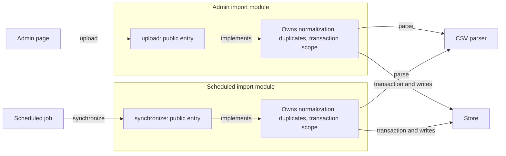

# Diagnostic cases

These constructed examples distinguish evidence of caller burden from superficial signs of shallowness. They show diagnosis only; choosing a new boundary belongs to a design task.

## Repeated import policy across consumers

An admin upload and a scheduled import both call a parser, normalizer, matcher, and repository. Both also choose duplicate handling, transaction scope, and which row failures can be skipped. The parser has a small API and the repository has private fields.

The issue is not the number of helpers. Trace whether both consumers encode the same customer-import policy. Evidence might show email normalization in each consumer, duplicate decisions outside the matcher, and separately managed transaction lifetimes. A policy change then requires understanding and updating both workflows.

For this constructed case, a current-state map could look like this:

The repeated ownership labels make the finding visible: two workflow implementations encode the same decisions. The outside callers already have simple entry points; the maintenance burden sits in the admin and scheduled modules as consumers of parsing and storage. In a real report, cite the code that establishes these edges and labels. Do not turn this into an after diagram or imply that either module's private decomposition is itself the defect.

A useful finding identifies the specific shared decision, the two caller paths, and their coordination cost. If their behavior differs, establish whether that is intentional before calling it a bug. The parser may itself be deep for parsing; the defect can be at the larger workflow boundary.

Countercase: only one application entry point owns the policy and its callers simply submit input and consume a report. Its private helpers do not make that interface shallow. A test importing a pure parser for focused verification is not equivalent to an application caller bypassing the workflow.

## One method, substantial protocol

Consider an API shaped like `run(input, options)` whose callers must obtain a lease first, keep it alive, select compatible option combinations, interpret partial completion, and decide whether a retry will duplicate work.

One method hides little of the caller's real obligations. Look for those obligations in call sites and implementations: which states are legal, who owns cleanup, what survives failure, and what a caller can learn from a result. Signature length would miss the principal cost.

Some obligations may be required. If caller authority is needed to acquire the lease, or only the application can decide whether an operation may be repeated, that decision cannot simply be assumed to belong lower down. Diagnose the unexplained burden and state the constraint.

## A thin boundary that earns its place

An HTTP handler converts a request to a domain operation, translates domain outcomes into status codes, and enforces access control. Most of its body forwards arguments.

Check its actual responsibility before reporting a pass-through layer. Transport semantics or authority checks can justify the boundary. Similarly, a plugin adapter can isolate a genuinely different contract even with one current implementation; implementation count alone does not decide whether the seam is real.

A thin wrapper becomes a stronger candidate when callers must know both its vocabulary and its callee's protocol and it contributes no owned policy, translation, isolation, or compatibility value. State that observed extra learning cost; do not recommend deletion as part of the review.

## A wide interface for a real audience

A graphics API exposes explicit buffer ownership and synchronization because its consumers need predictable resource use. A convenience path serves ordinary application code; an expert path exposes more control.

Review each audience's actual job. Expert options that ordinary callers can ignore do not all impose the same cost on the common path. Conversely, a supposedly simple path that still requires manual synchronization has not hidden that obligation.

Operators also have an interface: failure categories, correlation context, health, and recovery behavior. A module that conceals all failure detail may be easy to call and expensive to operate. Explain the tradeoff without treating maximum hiding as the objective.

## An incomplete contract versus a misplaced decision

A cache already owns expiry and refresh behavior, but its public documentation omits whether a failed refresh returns stale data. A consumer reads the implementation to discover that answer.

This supports a contract-clarity finding when the missing fact matters to correct use. It does not establish that refresh policy belongs in a different module. Inspect whether consumers merely need a stable semantic promise or must duplicate the cache's internal decision logic; those are different diagnoses.

Distinguish ordinary use from expert investigation. Opening cache internals to diagnose a rare corruption is not proof that its abstraction fails for routine consumers.

## Green checks, unresolved depth

A package exports only its public entry point and all dependency checks pass. Its exported API nevertheless mirrors each internal processing step, leaving consumers to sequence calls and recover intermediate state.

The checks establish which imports are allowed. They do not establish whether useful policy is owned inside that boundary. Conversely, a codebase without an architecture checker can still have a useful, consistently respected boundary.

Report bypasses or protocol costs only when the code supports them. Missing a particular analyzer, API snapshot, or CI rule is not itself a depth finding.
