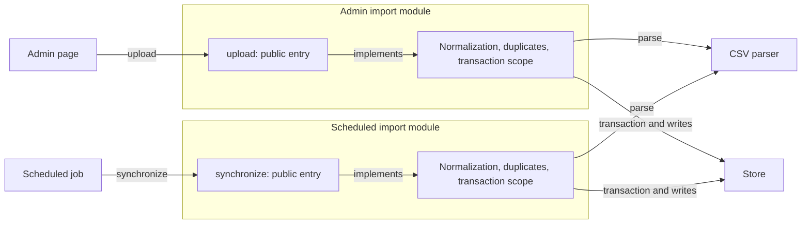
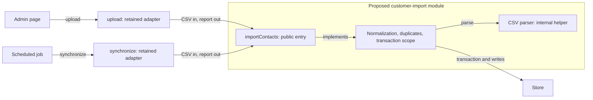

# Contrasting Boundary Designs

Use these contrasts to generate credible designs from the caller's job and system constraints. They are prompts, not a catalog that every task must exhaust.

## Complete operation

A single operation accepts the caller's input and returns a domain result. The module owns orchestration, defaults, retries or transactions where appropriate, and expected partial outcomes.

This shape fits when callers want one coherent job completed in one interaction. Its contract must still state observable policy, failure atomicity, resource behavior, and diagnostics. It becomes shallow if a large option bag makes the caller reconstruct the workflow.

## Stateful session or staged workflow

A session exposes explicit phases such as prepare, inspect, and commit. It fits when phases happen at different times, in different processes, or under different authorities, or when intermediate state is itself a product capability.

Account for lifetime, persistence, invalidation, idempotency, concurrent use, restarts, cleanup, and whether commit can observe changed inputs. Do not introduce this protocol merely because the implementation happens to have stages.

## Stream or event interface

A stream exposes incremental results, progress, or backpressure. It fits when inputs exceed useful buffering limits, latency to first result matters, or callers genuinely consume partial results.

Specify completion, ordering, cancellation, partial failure, resource ownership, and consistency. If every caller must rebuild aggregation and completion policy, prefer a complete operation or provide a deep convenience layer over the stream.

## Layered common-case and expert interfaces

A deep common-case operation can coexist with a low-level expert surface when explicit control is the requirement for a real audience. Keep the low-level path clearly separated so its machinery does not burden ordinary callers. State how the layers interact and which compatibility promises apply to each.

## Separate modules

Keep a seam when parts vary independently in reality or require separate privilege, deployment, process, ownership, scaling, or failure containment. Give each side a cohesive contract; a remote hop or interface file does not by itself make either side deep.

Merge or internalize a seam when the pieces share a policy or invariant, always change together, and the boundary only forwards calls. Do not erase an isolation boundary to make the source tree look simpler.

## Comparing candidates

For each credible candidate, trace representative caller jobs and failures. Compare:

- caller concepts, coordination, and lifecycle obligations;
- decisions and invariants owned by the module;
- defaults, error and recovery semantics, observability, and escape hatches;
- change locality and compatibility cost;
- performance, security, deployment, and failure consequences;
- support for existing, demonstrated variation.

Prefer the candidate that offers the most useful cohesive capability for the least total burden on its intended audiences. A narrow declaration with surprising behavior is not a simple interface, and a cohesive explicit low-level interface can be the honest choice.

## Example: move import policy behind one boundary

This constructed refactor preserves admin and scheduled entry points while concentrating their shared import policy. The diagrams show ownership, not a required directory layout.

**Current:** both entry points coordinate the same policy themselves.

**Proposed:** existing entry points delegate the complete job to one policy owner.

The important difference is that import callers no longer choose normalization, duplicate handling, or transaction policy. Parsing is still decomposed internally. Storage remains a dependency, and the retained entry points still carry compatibility cost. Explain whether each adapter is a permanent supported interface or a temporary migration step.

Pair the visual with the proposed contract: for example, `importContacts(csv) -> ImportReport`, with storage supplied at construction, if that fits the project. Spell out row validity, duplicate policy, atomicity, and failures; arrows alone cannot establish them. Moving that policy preserves the existing behavior unless a semantic change is separately agreed.

Compare a staged or streaming design visually only if real preview, resource, or deployment requirements justify different caller obligations. After implementation, reconcile the proposed map with actual callers and remaining adapters before labeling it implemented.

These contrasts apply Ousterhout's [Modular Design principles](https://web.stanford.edu/~ouster/cgi-bin/cs190-winter18/lecture.php?topic=modularDesign): information hiding, interface cost, and comparing designs. The specific workflow choices above are practical applications, not a prescribed set of designs from the source.
